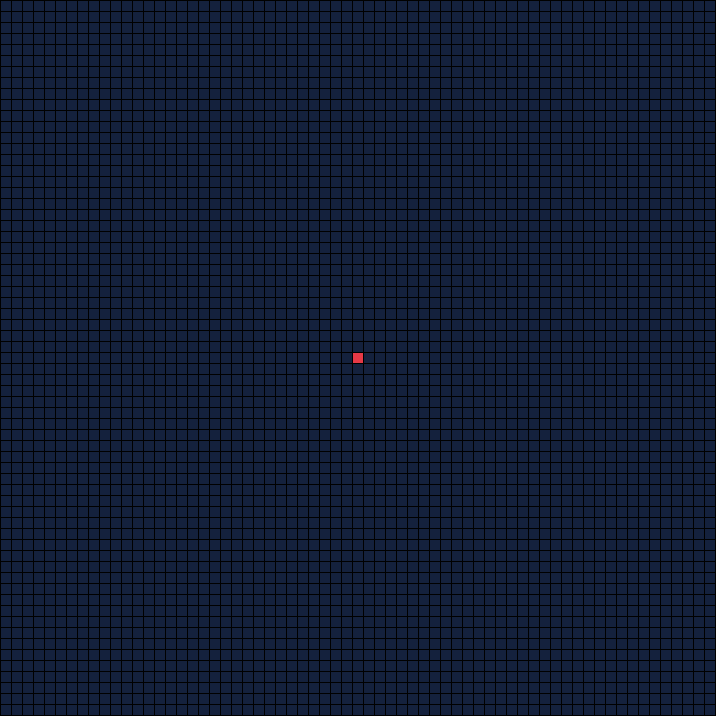

# automata
The `automata` project offers a generic approach to simulate various cellular automata. My purpose was to have a flexible platform to experimtent with CAs, so one can hook into several points of the simulation an monitor the process. A side effect of this was that the project now offers the possibility of printing the CAs in a variety of ways.

## Visualization

### Rule 110 by Stephen Wolfram
[Rule](https://en.wikipedia.org/wiki/Rule_110) is one of the [elementary cellular automatons](https://en.wikipedia.org/wiki/Elementary_cellular_automaton) with the most complex and interesting behavior.


### Gosper glider gun in Conway's Game of Life
The Gosper glider gun was the first [gun](https://en.wikipedia.org/wiki/Gun_(cellular_automaton)), one type of an infinitely growing pattern, to be found within [Game of Life](https://en.wikipedia.org/wiki/Conway%27s_Game_of_Life), detected by [Bill Gosper](https://en.wikipedia.org/wiki/Bill_Gosper#Conway's_Game_of_Life).


### Diamoeba
The Diamoeba is another [life-like](https://en.wikipedia.org/wiki/Life-like_cellular_automaton) cellular automaton defined by a set of rules differing from the original Game of Life. The Diamoeba tends to form more or less solid structures that can be used e. g. for generating random terrain in computer games.


### XOR-Gate in Wireworld
The [Wireworld](https://en.wikipedia.org/wiki/Wireworld) is a cellular automaton specifically designed to simulate the behaviour electron flow and transistors.


### Langton's Ant with a modified rule of LLRR
Since [Langton's ant](https://en.wikipedia.org/wiki/Langton%27s_ant) is one of the simplest cellular automata, I decided to implement it with the more general apporach of [multiple colors and commands](https://en.wikipedia.org/wiki/Langton%27s_ant#Extension_to_multiple_colors). This is a simulation of an LLRR ant building strange cerebral structures over 150,000 generations, showing only every 1,000th generation.


### Rule 110 again
...just to prove one is also able to generate more visually appealing representations of cellular automations.


## Code Examples

### Elementary Cellular Automata
See classes under `src/test` `de.algoristic.automata.evolution` for further exaples.

The `automata` project offers various possibilities of creating, monitoring and printing your automata. You can hook into every stage of the transition process of the automaton which enables the shown (build-in) printing functions.

```java
Automaton automaton = Automaton.Builder.wolframsUniverse(110) // binary representation of rule to be applied
    .chaotic(51) // generates a random pattern of 51 dead or alive cells
    .withRuntime(51) // ...and defines a running time of 51 generations
    .build();
automaton.run();
```

### Conway's Game Of Life (and any other Life-like Cellular Automata)

```java
Seed seed = new RandomSeed(25, 25); // will create a random pattern of dead or alive cells on a 25x25 grid
Automaton automaton = Automaton.Builder.gameOfLife("B2/S23") // literal representation of the life-like rule to be applied
    .withSeed(seed) // use the defined seed as start
    .withRuntime(25) // ...defines a running time of 25 generations for the simulation
    .build();
automaton.run();
```

### Langton's Ant (and some other Turmites)


```java
Turmites rule = Turmites.getInstance("LLRR"); // create a generic turmite rule from its' literal representation
TurmitesRuleMetadata metadata = rule.getMetadata();

// define a simple printer that compiles the complete lifecycle of the automaton into a single GIF file
Path directory = Paths.get("path/to/your/output/directory");
LifeCyclePrinter printer = new LifeCyclePrinter(directory.resolve(supplier + ".gif")); // printer for the compilation of the final GIF
Printer<FinishBreedingEvent> automationStepPrinter = new Printer.Builder(directory) // printer for the single generations
  .withCallback(printer::addFile) // notify printer for every file t be compiled into GIF
  .withColorMapping(ColorModel.TURMITES(metadata)) // use a predefined color model for printing
  .buildEvolutionStepPrinter();

Automaton automaton = Automaton.Builder
  .turmites(rule) // use the defined rule
  .withSeed(new AntSeed(5)) // starts with an empty 5x5 grid, populated by a single ant at the center
  .withRuntime(10) // define a running time of 10 generations
  .build();
automaton.registerFinishBreedingListener(automationStepPrinter); // register printer for the single generations
automaton.run();
printer.print(25); // compile the generation-images to a single GIF file with 25 FPS
```

### Wireworld

```java
Seed seed = new TemplateFile("path/to/your/seedfile.txt"); // use a seed file with representation of cell states for predefined non-random  structures
Automaton automaton = Automaton.Builder.wireworld()
  .withSeed(seed) // use the defined seed
  .withRuntime(17) // define a running time of 17 generations
  .build();
automaton.run();
```

### More complex printing example
See classes under `src/test` `de.algoristic.automata.prod` for further exaples.

```java
Path destination = Paths.get("path/to/your/directory");
ColorModel colors = new Coolors()
  .withMapping(BinaryState.DEAD, Coolors.richBlackFOGRA29)
  .withMapping(BinaryState.ALIVE, Coolors.platinum)
  .withBackground(Coolors.richBlackFOGRA29)
  .withFrameColor(Coolors.richBlackFOGRA29)
  .build();
IntStream.range(0, 256).forEach(rule -> {
  Printer<FinishAutomationEvent> printer = new Printer.Builder(destination)
    .withColorMapping(colors)
    .withCellSize(8)
    .withScaling(2)
    .withFrameWidth(8*20)
    .withBorder(2)
    .buildElementaryPrinter();
  Automaton automaton = Automaton.Builder
    .wolframsUniverse(rule)
    .chaotic(101)
    .withRuntime(101)
    .build();
  automaton.registerFinishAutomationListener(printer);
  automaton.run();
});
```
